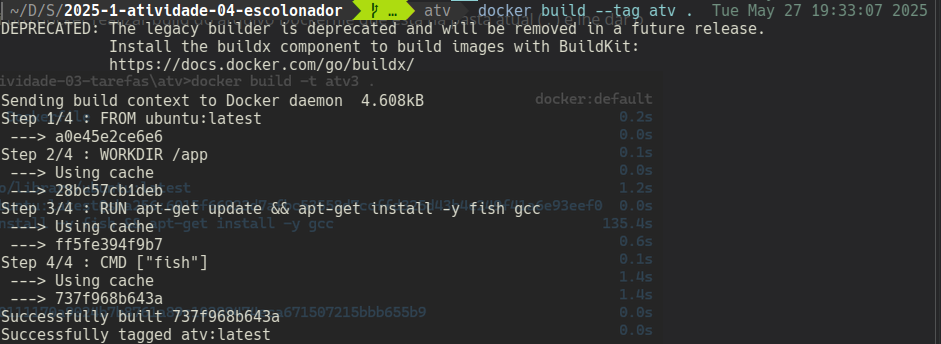
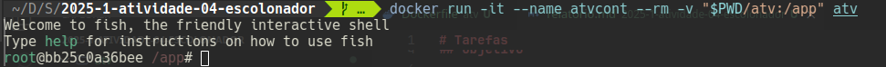
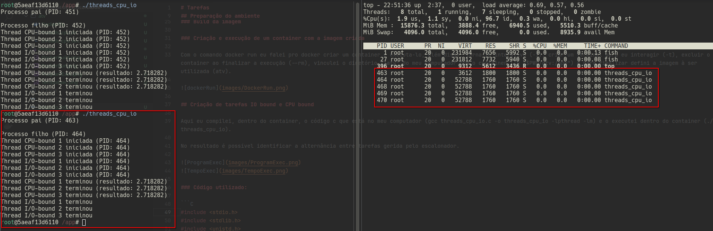
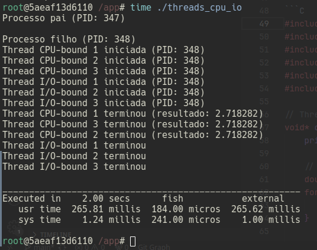

# Tarefas

### Nicollas Matheus Prado Pinheiro - 27/05/2025

## Objetivo

Com a utilização de docker, terminal linux e conhecimentos adquiridos em aula sobre o escalonador de tarefas essa atividade tem o objetivo de comparar dois tipos diferentes - vinculadas a cpu e vinculadas a I/O - analisando como o escalonador as gerencia.

## Preparação do ambiente

### Criação da imagem docker

Com o comando FROM eu defini o sistema operacional, no caso ubuntu na última versão LTS, a partir disso, executei comandos apt-get do mesmo para atualizar o sistema (apt-get update), instalar o terminal fish e instalar o compilador gcc. Além disso, criei um diretório no container chamado app e defini ele como o diretório de trabalho no build e então defini a execução do terminal fish como comando de inicialização (CMD ["fish"]).

```DOCKER
FROM ubuntu:latest

WORKDIR /app

RUN apt-get update && apt-get install -y fish gcc

CMD ["fish"]
```

### Build da imagem

Com o comando "docker build --tag atv ." eu falei pro docker realizar build do arquivo Dockerfile que está na pasta atual ( . ) e lhe dar o nome, ou tag, "atv" com o comando "--tag atv".



### Criação e execução de um container com a imagem criada

Com o comando docker run eu falei pro docker criar um container e executa-lo, além disso, torna-lo interativo (-i), criar um terminal para eu interagir (-t), excluir o container ao finalizar a execução (--rm), vinculei o diretório "/atv" do meu computador com o container (-v "$PWD/atv:/app") e para finalizar defini a imagem à ser utilizada (atv).



## Criação de tarefas IO bound e CPU bound

Aqui eu compilei, dentro do container, o código c que está no meu computador (gcc threads_cpu_io.c -o threads_cpu_io -lpthread -lm) e o executei dentro do container (./threads_cpu_io).

No resultado é possível identificar a alternância entre tarefas gerida pelo escalonador.




### Código utilizado:

```C
#include <stdio.h>
#include <stdlib.h>
#include <unistd.h>
#include <pthread.h>
#include <sys/wait.h>
#include <math.h>

// Thread CPU-bound (cálculos intensivos)
void* cpu_thread(void* arg) {
    printf("Thread CPU-bound %ld iniciada (PID: %d)\n", (long)arg, getpid());

    // Cálculo intensivo (série de Taylor para e^x)
    double sum = 0;
    for(int i = 0; i < 10000000; i++) {
        sum += pow(1.0, i) / tgamma(i+1);
    }

    printf("Thread CPU-bound %ld terminou (resultado: %f)\n", (long)arg, sum);
    return NULL;
}

// Thread I/O-bound (simula espera)
void* io_thread(void* arg) {
    printf("Thread I/O-bound %ld iniciada (PID: %d)\n", (long)arg, getpid());
    sleep(2);  // Simula operação I/O
    printf("Thread I/O-bound %ld terminou\n", (long)arg);
    return NULL;
}

int main() {
    pid_t pid;
    pthread_t thread_cpu1, thread_cpu2, thread_cpu3, thread_io1, thread_io2, thread_io3;

    // Cria processo filho
    pid = fork();

    if (pid == 0) { // Processo filho
        printf("\nProcesso filho (PID: %d)\n", getpid());

        // Cria threads CPU-bound
        pthread_create(&thread_cpu1, NULL, cpu_thread, (void*)1);
        pthread_create(&thread_cpu2, NULL, cpu_thread, (void*)2);
        pthread_create(&thread_cpu3, NULL, cpu_thread, (void*)3);

        // Cria threads I/O-bound
        pthread_create(&thread_io1, NULL, io_thread, (void*)1);
        pthread_create(&thread_io2, NULL, io_thread, (void*)2);
        pthread_create(&thread_io3, NULL, io_thread, (void*)3);

        // Espera todas as threads terminarem
        pthread_join(thread_cpu1, NULL);
        pthread_join(thread_cpu2, NULL);
        pthread_join(thread_io1, NULL);
        pthread_join(thread_io2, NULL);

    } else if (pid > 0) { // Processo pai
        printf("Processo pai (PID: %d)\n", getpid());
        wait(NULL); // Espera filho terminar
    }

    return 0;
}
```

## Conclusão

Após terminar a atividade eu percebi como o escalonador de tarefas gerencia os processos do SO, realizando alternâncias entre processos dependendo de como eles funcionam - CPU bound ou IO bound.
